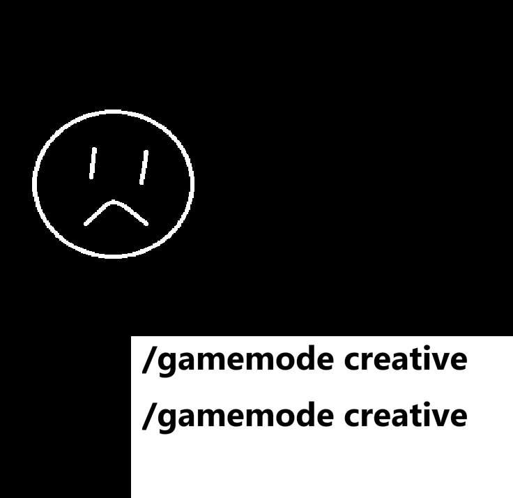
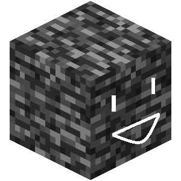
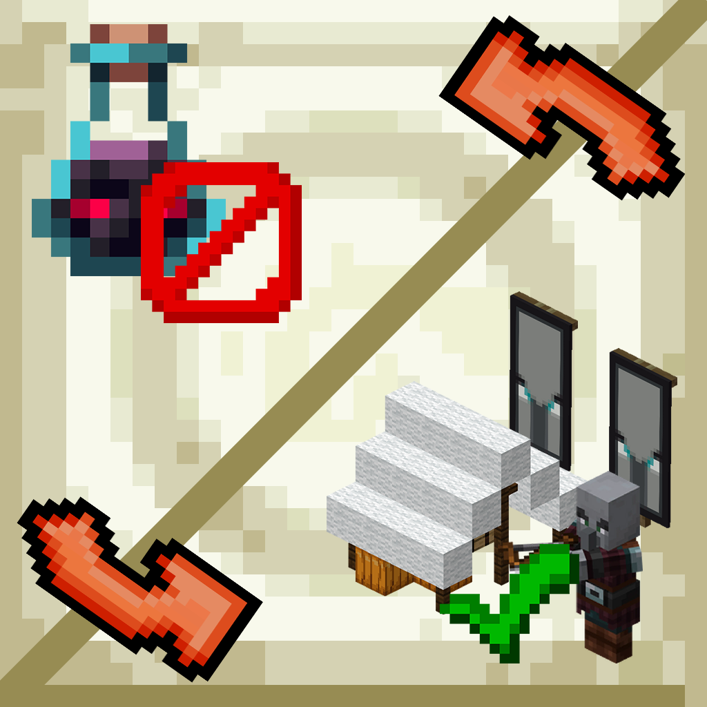
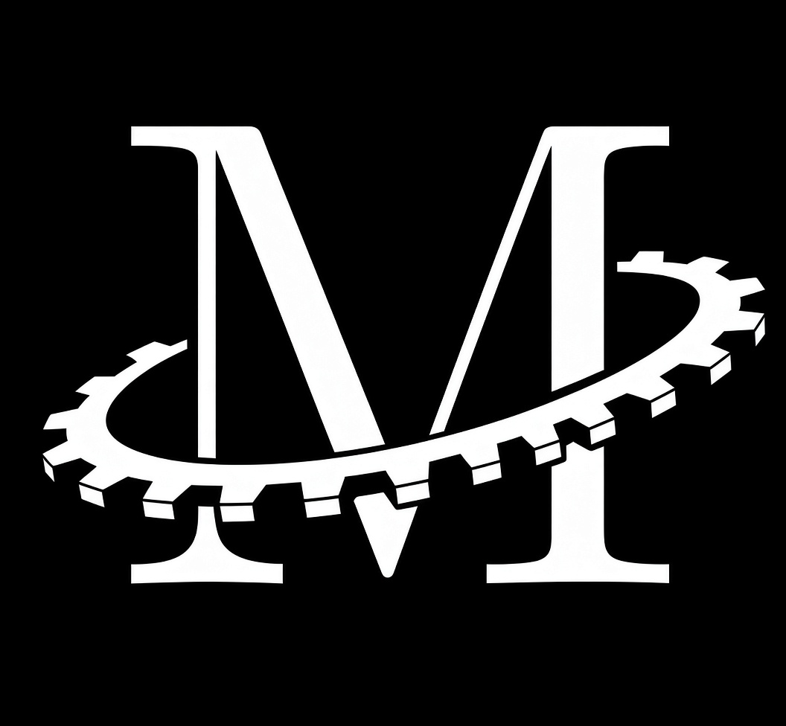

# Hi, I am Tagin_T(or Hiverfy_H)

Just someone making things which it wants. Currently working on *"realtime-time-manim"* *"Cheese"* and *"A-Nice-Bot"* the most. 

The founder of **Club Phormation** which is a club in Shanghai Pinghe Middle School. Also previously a member of **Pinghe Robotic Club Ironpulse**. "**Team Daydream**" which is mentioned in the organization part of my profile, is a group I have tried to start for a long time but never succeed...

---

## 🛠 Projects

### Big Ones
|Repository|Description|Logo|
|---|---|---|
|[real-time-manim](https://github.com/BEGINWITHF/real-time-manim.git) |A project trying to let manim users see their ***rendering results earlier*** by popping up a window so the the ***frames are shown and rendered at the same time***. ||
|[A-Nice-Bot](https://github.com/BEGINWITHF/A_Nice_Bot.git)|A project trying to make a bot that can work ***between multi-devices*** also with a always adapting memory system. It will ***not out put in words but in behavior*** codes that control a virtual body. (this can be a lot of work...)|COMING SOON...|

### Minecraft Mods and Plugins
> I only public on [Github](https://github.com/BEGINWITHF) and [Modrinth](https://modrinth.com/user/BEGINWITHF)(well... Modrinth review is quiet slow...)

|Name|Type|Description|Logo|
|---|---|---|---|
|[OP-Monitor](https://github.com/BEGINWITHF/OP-Monitor.git)|Paper Plugin|A Plugin to recognize op players' unusual behaviors then ***record and broadcast***. ||
|[Beautify-Bedrock-Friend](https://github.com/BEGINWITHF/Beautify-Bedrock-Friend.git)|Fabric Client Mod|A mod to help fixing the issue that in some Geyser/Floodgate servers, ***skins of bedrock players can not be shown*** to java players properly. ||
|[old-raid-mechanics](https://github.com/BEGINWITHF/old-raid-mechanics.git)|Paper Plugin|A Plugin to ***relive 1.20.1 raid mechanics*** in 26.2||
|[Cheese](https://github.com/BEGINWITHF/Cheese.git)|Fabric Client Mod|A mod that allows you to ***pose yourself in game*** with a similar way as in blender. |COMING SOON...|

### Just Ideas
> Things here might be started in the future...

|Name|Description|Logo|
|---|---|---|
|[Lending-Help](https://github.com/BEGINWITHF/Lending-Help.git)|A repository aim to let your ***AI agent operate on another computer*** by linking the two computers with a wire. |COMING SOON...|
|Manteraction|A GUI for ***editing manim lively***. ||

---
